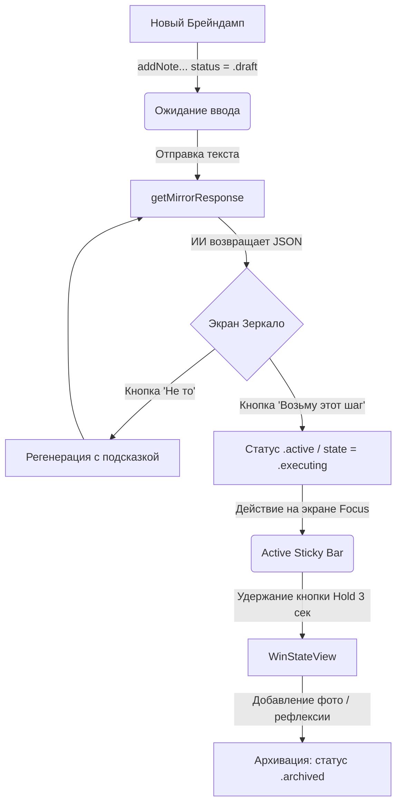

# Манифест Mentorio 2.0 (Mentorio 2.0 Manifest)
*Дата составления: Май 2026*

Данный документ представляет собой детальный, строго фактический анализ архитектуры, экранов, функций и структуры данных мобильного приложения **Mentorio** по состоянию на май 2026 года. В нём отражено реальное устройство системы без домыслов и предположений.

---

## 1. Концепция и суть приложения

**Mentorio** — это мобильное iOS-приложение (SwiftUI + SwiftData), выступающее в роли требовательного союзника по поведенческой активации (*Behavioral Activation*). 

### Главная цель приложения:
Помочь пользователю преодолеть прокрастинацию, паралич решений, неопределённый стресс или нехватку условий. Приложение берёт хаос мыслей человека (**braindump**), сжимает его до сухой сути проблемы (**highlight**) и предлагает **ровно один физический шаг на 10–15 минут**, оставляющий наблюдаемый артефакт во внешнем мире.

### Ключевые ценности:
- **No Soft Coaching**: Отсутствие сочувственных шаблонных фраз («я понимаю», «это нормально»). Только сухие факты и прямое действие.
- **Физический след (Physical Proof)**: Каждое завершённое действие требует фиксации материального подтверждения (фотографии или заметки) для исключения эффекта ложной продуктивности.
- **Борьба с амнезией**: Сохранение полного контекста диалога и незавершенных сессий (черновиков) в локальной базе данных.

---

## 2. Технологический стек

1. **Интерфейс (UI/UX)**: 
   - Нативный **SwiftUI** с кастомной премиальной темой оформления `MentorioTheme` (глубокие темные тона, размытия `ultraThinMaterial`, стеклянный стиль *LiquidGlass*).
   - Интерактивные микро-анимации на основе `TimelineView` (динамические градиентные гало на карточках с неоновым свечением).
   - Направленный тактильный отклик (**Haptic Feedback**) через `UIImpactFeedbackGenerator` и `UINotificationFeedbackGenerator`.
2. **База данных и локальное хранение**: 
   - **SwiftData** для декларативного объектного моделирования и персистентности данных.
   - Модели данных: `BraindumpNote` (основная сущность сессии), `MentorioSession` (сессионная история), `AnalyticsEventRecord` (локальная база событий аналитики).
3. **ИИ-сервис (AI Integration)**:
   - Сетевое взаимодействие через **OpenRouter API** (модель `openrouter/auto` по умолчанию).
   - Нативная поддержка кастомных локальных моделей (например, **Ollama**, запущенная на `localhost:11434`), настраиваемых пользователем через настройки.
   - Чистый JSON-контракт между сервисом и моделями ИИ, исключающий разговорные преамбулы и галлюцинации.
4. **Аналитика и Метрики**:
   - Локальный менеджер `AnalyticsManager` для ведения полной воронки конверсий и логов.
5. **Системные службы**:
   - `UserNotifications` для отправки деликатных напоминаний (срабатывают через 3 дня тишины).

---

## 3. Базовая архитектура данных

Основные сущности и их структура описаны в [JournalModels.swift](file:///Users/nickdobr/Documents/Mentorio/Mentorio/JournalModels.swift) и [Note.swift](file:///Users/nickdobr/Documents/Mentorio/Mentorio/Note.swift):

### А. Модель `BraindumpNote` (SwiftData `@Model`)
Является центральным узлом приложения и содержит:
- **Базовые поля**: `id: UUID`, `text: String` (исходный текст брейндампа), `createdAt: Date`.
- **Состояния конечного автомата**: `state: NoteState` (сериализуется в JSON-строку `stateJSON`):
  - `.idle` — режим ожидания;
  - `.analyzing` — идёт запрос к ИИ;
  - `.needsTopic(topics: [String])` — требуется выбор темы (Legacy-ветка);
  - `.clarifying(question: String)` — требуется ответ на вопрос (Legacy-ветка);
  - `.hasTactics(choices: [String], ...)` — ИИ предложил варианты тактик (Legacy-ветка);
  - `.executing(action: String)` — шаг утвержден и находится в процессе выполнения.
- **Поля сессионного черновика (v2.0 Draft & Hydration)**:
  - `status: NoteStatus` (перечисление: `.draft`, `.active`, `.archived`);
  - `chatHistoryData: Data?` (закодированная история реплик диалога);
  - `pendingQuestion: String?`, `pendingChoicesJSON: String?`, `pendingTopicsJSON: String?` (для восстановления состояния при перезапуске);
  - `contextSummary: String?` (сгенерированное ИИ краткое резюме беседы).
- **Данные анализа ИИ**:
  - `storedHighlight: String?` — выделенная суть проблемы;
  - `storedAction: String?` — предложенное действие;
  - `actionEmoji: String?` — эмодзи, подобранный ИИ под тематику действия.
- **Данные архивации и подтверждения**:
  - `isCompleted: Bool` — флаг успешного завершения;
  - `completedAt: Date?` — точное время фиксации победы;
  - `photoData: Data?` — бинарные данные прикрепленного фото-доказательства;
  - `completionProof: String?` — текстовый маркер пруфа (например, `"local"`);
  - `userClarification: String?` — текстовые заметки к победе (рефлексия пользователя);
  - `realityCheck: RealityCheckResult?` — оценка сложности выполнения (`.easierThanExpected` / `.hardWork`).
- **Корзина**: `isInTrash: Bool`, `deletedAt: Date?`.

### Б. Модель `AnalyticsEventRecord` (SwiftData `@Model`)
Хранит записи событий аналитики в локальной базе данных. Поля:
- `id: UUID`, `name: String`, `createdAt: Date`, `propertiesJSON: String`.
- Вычисляемое свойство `properties: [String: String]` для работы со словарем параметров.

---

## 4. Ядро сценария использования (Core Loop)

Основной цикл взаимодействия в версии 2.0 состоит из следующих этапов:



### Шаг 1: Свободный брейндамп
Пользователь открывает форму и изливает текущий хаос мыслей (что мешает, почему стоит задача, какая тревога). Создается объект `BraindumpNote` со статусом `.draft`.

### Шаг 2: Анализ «Зеркало» (Single-shot)
Приложение отправляет ровно один запрос к ИИ. Метод `MentorioAIService.getMirrorResponse` передает специальный системный промпт и получает JSON с тремя полями: `highlight`, `action` и `emoji`. 

### Шаг 3: Выбор действия
Пользователю показывается премиальная анимированная карточка **«Зеркало»** с выделенной сутью и конкретным действием. 
- **Принятие**: При нажатии «Возьму этот шаг» заметка переводится в статус `.active` и состояние `.executing(action:)`. Черновик стирается, сессия закрывается.
- **Регенерация**: При нажатии «Не то» ИИ отправляется повторный запрос с инструкцией дать принципиально иной шаг на основе обратной связи.

### Шаг 4: Выполнение и удержание (Focus Hold)
На главном экране Focus закрепляется плашка активного действия. Чтобы отметить его выполнение, пользователь должен зажать и удерживать круглую кнопку **Hold** в течение 3 секунд. Haptics нарастает с каждой секундой (light -> medium -> rigid -> success), создавая физическое ощущение преодоления сопротивления.

### Шаг 5: Фиксация победы и рефлексия
Открывается экран завершения `WinStateView`. Пользователю предлагается сфотографировать артефакт выполненной работы (камера) либо прикрепить скриншот (галерея), после чего победа переносится во вкладку **Archive**, а в карточку добавляется текстовая рефлексия.

---

## 5. Экраны приложения и их функциональность

Вся навигация строится на [RootView.swift](file:///Users/nickdobr/Documents/Mentorio/Mentorio/RootView.swift) через `TabView` с двумя вкладками: **Focus** и **Archive**.

### ЭКРАН 1: Focus Dashboard (Вкладка «Focus»)
Файл: [FocusDashboardView.swift](file:///Users/nickdobr/Documents/Mentorio/Mentorio/FocusDashboardView.swift)
- **Active Sticky Bar**: Верхняя закрепленная панель. Отображается только тогда, когда в БД есть заметка со статусом `.active` в состоянии `.executing`. Содержит текст шага и интерактивную кнопку удержания `HoldToCompleteButton` с круговым таймером.
- **Drafts List**: Список незаконченных сессий (заметок в статусе `.draft`). 
  - Отображает карточки с оригинальным текстом брейндампа.
  - Поддерживает удаление свайпом влево.
  - При тапе на карточку срабатывает механизм **Hydration** (восстановление сессии) — открывается оверлей ровно в том состоянии, в котором пользователь закрыл его ранее (например, на этапе карточки «Зеркало»).
- **Floating Action Button (FAB) «+»**: Круглая кнопка по центру внизу для быстрого запуска новой сессии.

### ЭКРАН 2: Dialog Overlay (Оверлей ввода)
Файл: [EntryOverlayView.swift](file:///Users/nickdobr/Documents/Mentorio/Mentorio/EntryOverlayView.swift)
- Полноэкранный прозрачный оверлей с размытым задним планом и радиальным градиентом.
- Имитирует чат-транскрипт (iMessage-style): выводит исходный вопрос ментора, ответ пользователя и лог сообщений.
- **Mirror Card**: Кастомный анимированный компонент `MirrorCardView`.
  - Задний план — вращающийся двухслойный угловой градиент (аура) персиково-розовых тонов, создающий неоновое свечение.
  - Текст сути («СУТЬ») и действия («ОДИН ШАГ») разделены тонкой полупрозрачной линией.
  - Две кнопки: «Возьму этот шаг» (золотая заливка `MentorioTheme.accent`) и «Не то» (прозрачная кнопка с размытием).

### ЭКРАН 3: Step Done (Экран триумфа)
Файл: [WinStateView.swift](file:///Users/nickdobr/Documents/Mentorio/Mentorio/WinStateView.swift)
- Открывается при успешном удержании кнопки Hold на активном шаге.
- Выводит крупный заголовок **STEP DONE** и текст выполненного действия.
- Предоставляет меню выбора пруфа: «Сделать фото» (вызывает системную камеру через `CameraImagePicker`) или «Выбрать из галереи» (через `PhotosPicker`).
- Кнопка «To Archive» для перехода во вкладку архива.

### ЭКРАН 4: Archive (Вкладка «Archive»)
Файл: [ArchiveView.swift](file:///Users/nickdobr/Documents/Mentorio/Mentorio/ArchiveView.swift)
- **Monthly Summary**: Карточка аналитики текущего месяца.
  - Раскрывается по тапу с плавной анимацией.
  - Показывает статистику: общее число побед, количество активных дней, streak (серию побед подряд) и самый продуктивный день недели.
  - Сетка активности **Activity Dots**: Календарная сетка текущего месяца, где дни с выполненными шагами подсвечены персиковым цветом, а текущий день выделен номером.
  - Генерирует текстовый вывод на основе активности (например: *«Ты не каждый день действовал, но регулярно к этому возвращался»*).
- **Day Grouped Cards**: Список побед, сгруппированный по дням (TODAY, YESTERDAY, даты).
  - Карточки `WinCard` содержат миниатюру (сфотографированный пруф с пониженной насыщенностью на 30% для кинематографичного эффекта, либо сгенерированный ИИ эмодзи действия).
  - Текст действия, дата/время и исходный highlight.
  - Контекстное меню по кнопке с тремя точками: возможность поделиться победой через системный `ShareLink` или удалить её.

### ЭКРАН 5: Archive Detail (Детали победы)
Файл: [ArchiveDetailView.swift](file:///Users/nickdobr/Documents/Mentorio/Mentorio/ArchiveDetailView.swift)
- Открывается при нажатии на карточку в архиве. Полноэкранный темный режим.
- Показывает дату, текст шага в крупном засеченном шрифте (serif), прикрепленный фото-артефакт.
- Поле ввода **Reflection (Заметки к победе)**: текстовый редактор `TextEditor`, где пользователь может записать, что было самым важным в этой победе. Данные мгновенно сохраняются в поле `userClarification` модели заметки.

### ЭКРАН 6: Settings (Настройки)
Файл: [SettingsView.swift](file:///Users/nickdobr/Documents/Mentorio/Mentorio/SettingsView.swift)
- **Профиль**: Поле изменения имени пользователя `userName` (для кастомизации обращений ИИ).
- **Оформление**: Переключатель темы `appTheme` (Светлая / Темная / Системная).
- **Уведомления**: Статус системных уведомлений и кнопка их включения.
- **OpenRouter API Key**: Поле ввода персонального ключа ИИ для тех, кто хочет использовать свои лимиты.
- **Кастомный AI (Ollama)**: Настройки для локального запуска моделей. Поля: Base URL, API Key, Model. Если заполнены, приложение полностью переключается на них.
- **Данные**: Ссылка на корзину и раздел приватности.
- **Отладка (Diagnostics)**: Переход в скрытую панель диагностики или полный сброс базы данных.

### ЭКРАН 7: Recently Deleted (Корзина)
Файл: [RecentlyDeletedView.swift](file:///Users/nickdobr/Documents/Mentorio/Mentorio/RecentlyDeletedView.swift)
- Показывает список удаленных брейндампов. 
- Позволяет восстановить их (при этом сессионные поля сбрасываются во избежание багов, и заметка возвращается на вкладку Focus в чистом виде) или удалить навсегда.

### ЭКРАН 8: Diagnostics Dashboard (Панель диагностики)
Файл: [DiagnosticsView.swift](file:///Users/nickdobr/Documents/Mentorio/Mentorio/DiagnosticsView.swift)
- **Состояние приложения (Live State)**: Статистика базы данных в реальном времени (сколько заметок всего, сколько шагов в работе, сколько черновиков лежит без действия, сколько сессий ждет принятия шага).
- **Conversion Funnel**: Визуализация воронки конверсии по событиям аналитики:
  1. Написали брейндамп (`braindump_started`)
  2. Зеркало получено (`mirror_generated`)
  3. Шаг принят (`one_action_accepted`)
  4. Шаг начат (`one_action_started`)
  5. Шаг выполнен (`one_action_completed`)
  - Отображает проценты перехода между шагами и цветовые индикаторы здоровья воронки (зеленый > 70%, красный < 40%).
  - Выводит временные метрики: **TFA** (время от мысли до принятия шага) и **TFC** (время от мысли до выполнения).
- **Уведомления**: Список запланированных пушей и кнопка тестирования (отправка пуша через 10 секунд).
- **Лог аналитики**: Разворачиваемый лог системных и продуктовых событий в хронологическом порядке с возможностью фильтрации и копирования.

---

## 6. Решённые технические проблемы и улучшения

В процессе эволюции приложения до версии 2.0 были устранены следующие критические уязвимости:

1. **Интерфейсная Амнезия (Interface Amnesia)**:
   - *Было*: Приложение перезаписывало исходный брейндамп пользователя в процессе уточняющих вопросов, из-за чего терялся контекст.
   - *Стало*: Внедрено раздельное хранение исходного текста, скрытого транскрипта и сессионного кэша во SwiftData. Полный контекст надежно удерживается на протяжении всей сессии.
2. **Дублирование сообщений во фреймворке SwiftUI**:
   - *Было*: При перерисовках экранов сообщения в чат-оверлее могли удваиваться.
   - *Стало*: Внедрен метод `safeAppendToChat`, проверяющий уникальность идентификаторов сообщений перед обновлением UI.
3. **Сохранение сессий и Hydration**:
   - *Было*: Если пользователь закрывал оверлей на этапе генерации шага или выбора, все данные терялись.
   - *Стало*: Черновики сохраняются в БД. Метод `hydrateFromExisting` восстанавливает точное состояние оверлея при повторном открытии draft-карточки.
4. **Сбои разметки JSON**:
   - *Было*: Модели ИИ периодически присылали разговорный текст (например, «Окей, я готов...») перед JSON-кодом, что ломало парсер.
   - *Стало*: Внедрена жесткая санитария в `cleanJSONText`, отсекающая markdown-блоки ` ```json ` и извлекающая данные строго по границам фигурных скобок `{ ... }`. При отсутствии JSON генерируется явное исключение.
5. **Галлюцинации личных данных**:
   - *Было*: В примерах ИИ-промптов содержались жестко прописанные личные данные (имя «Никита», город «Белград», программа «FL Studio»), из-за чего ИИ навязывал их другим пользователям.
   - *Стало*: Все примеры в промптах переписаны на обобщенные и абстрактные формулировки.

---

## 7. Карта файлов проекта и их роли

```
Mentorio/
├── API Config.xcconfig               # Конфигурация API ключей для сборки
├── ANALYTICS_EVENT_CONTRACT_V1.md    # Спецификация событий аналитики
├── ARCHIVE_SYSTEM_IMPLEMENTATION.md  # Документация системы архивации
├── AUDIT_REPORT.md                   # Аудит-отчет по исправлению JSON-парсинга
├── FINDINGS.md                       # Анализ проблемы разговорных ответов ИИ
├── IMPLEMENTATION_VERIFIED.md        # Чек-лист тестирования архива побед
├── Mentorio/                         # Исходный код приложения
│   ├── MentorioApp.swift             # Точка входа в приложение, запуск RootView
│   ├── RootView.swift                # Навигационный каркас (TabView: Focus / Archive)
│   │
│   ├── JournalModels.swift           # SwiftData-модели и конечный автомат состояний
│   ├── Note.swift                    # Легаси-модель и перечисление NoteStatus
│   │
│   ├── MentorioViewModel.swift       # Бизнес-логика, управление базой, вызовы ИИ
│   ├── MentorioAIService.swift       # Интеграция с LLM (генерация зеркал, шагов, резюме)
│   ├── AnalyticsManager.swift        # Запись продуктовых и отладочных событий в БД
│   ├── NotificationManager.swift     # Планирование локальных push-уведомлений
│   ├── SummaryDigestService.swift    # Сборка еженедельных сводок и отчетов
│   │
│   ├── FocusDashboardView.swift      # Экран Focus (активный шаг, удержание Hold, список черновиков)
│   ├── EntryOverlayView.swift        # Интерактивный чат-оверлей с карточкой Зеркало
│   ├── WinStateView.swift            # Экран Step Done (фиксация пруфа победы)
│   ├── ArchiveView.swift             # Экран архива побед, календарь и статистика за месяц
│   ├── ArchiveDetailView.swift       # Просмотр конкретной победы, добавление рефлексии
│   ├── SettingsView.swift            # Экран настроек (профиль, темы, API, Ollama)
│   ├── RecentlyDeletedView.swift     # Корзина удаленных брейндампов
│   ├── DiagnosticsView.swift         # Панель отладки, воронка конверсий, лог событий
│   │
│   ├── WelcomeView.swift             # Онбординг-экраны приветствия
│   ├── PrivacyView.swift             # Экран политики приватности
│   ├── PreviewHelpers.swift          # Моки и хелперы для SwiftUI Previews
│   ├── MentorioStyle.swift           # Дизайн-токены (цвета, шрифты, метрики легаси-дизайна)
│   └── MentorioTheme.swift           # Основная дизайн-система версии 2.0 (Glassmorphism)
```

---
*Документ составлен на основе прямого статического анализа кодовой базы проекта Mentorio.*
